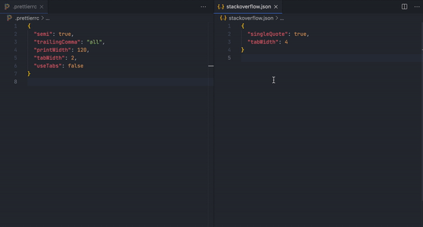

# MergeConf

Merge configurations **(JSON for now)** with ease.

### This is my first extension and it is far from complete. Support and feedback are welcome 🙌🏻

## Features

#### Merge content of a config file with other config by pasting text:

Current strategy is to add extra properties to the original config without overriding existing ones.

1. Open a config file
2. Find the `Merge with other config` option in the editor options menu (Right-click inside the editor)
3. Paste the configurations you have
4. Press enter to merge

**Enjoy!**
